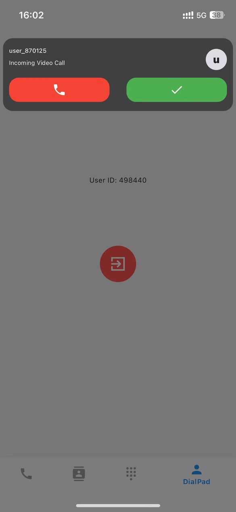
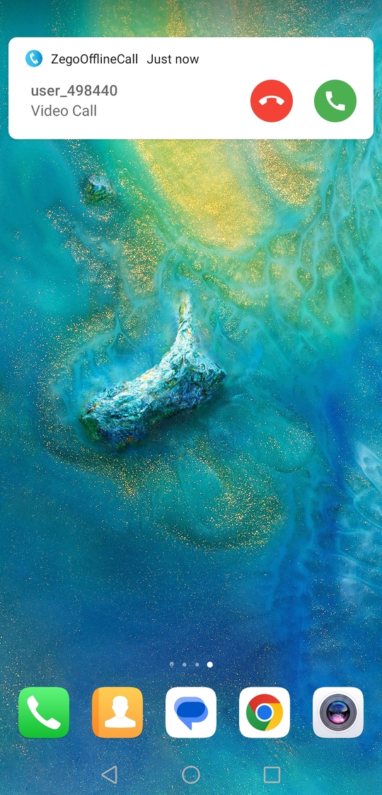

# zego_call_flutter

Online/Offline call implemented using ZEGO SDK

# Libraries

- flutter_dialpad-1.0.5

  call dialpad from [pub.dev](https://pub.dev/packages/flutter_dialpad)

- zego_callkit_incoming

  plugin library of android notification

- zego_push

  plugin library of push

- zego_call

  App project, online/offline call

  - Effects:

    

    | Online Notification                                         | Offline Notification(iOS)                                             | Notification(Android)                                                         | In Call                                   |
    | ----------------------------------------------------------- | --------------------------------------------------------------------- | ----------------------------------------------------------------------------- | ----------------------------------------- |
    |  |  |  |  |

- zego_live

  App project, offline notification in live

  - Effects:

    

# How to run

## Config AppID & AppSign

 - Go to [ZEGOCLOUD Admin Console](https://console.zegocloud.com/) to create a UIKit project.
 - Get the `AppID` and `AppSign` of the project
 - Config `yourSecretID` and `yourSecretAppSign` in **zego_call/lib/app/constants.dart**

## Config offline call

If you encounter configuration issues, please consult our technical support or refer to this [article](https://www.zegocloud.com/docs/uikit/callkit-flutter/quick-start-(with-call-invitation))

> When you get the resource id from the following steps, you should configure it to `offlineResourceID` in **zego_call/lib/call/constants.dart**

- android
  
  Please refer to the following steps to configure your Android project. 
  - Firebase Console and ZEGO Console Configuration
    - In the Firebase console: Create a project. (Resource may help: [Firebase Console](https://console.firebase.google.com/))
      
      
      
    - In the ZegoCloud console: Add FCM certificate, create a resource ID
      > In the create resource ID popup dialog, you should switch to the VoIP option for APNs, and switch to Data messages for FCM.
      
      
      
      When you have completed the configuration, you will obtain the resourceID. You can refer to the image below for comparison.
      
      
    - In the Firebase console: Create an Android application and modify your code
      
     

  - Replace your google-service.json 

- iOS
  
  Please refer to the following steps to configure your iOS project.

  - Apple Developer Center and ZEGOCLOUD Console Configuration
    - You need to refer to [Create VoIP services certificates](https://developer.apple.com/help/account/create-certificates/create-voip-services-certificates/) to create the   VoIP service certificate, and ​​​​​​​​​​​​​​​​​​​​​​​​​​​​​​​​​​​​​​​​export a .p12 file on your Mac.
      
    - Add the voip service certificate .p12 file. Then, create a resource ID
      > ​In the create resource ID popup dialog, you should switch to the VoIP option for APNs, and switch to Data messages for FCM.
      
      

      When you have completed the configuration, you will obtain the resourceID. You can refer to the image below for comparison.
      

