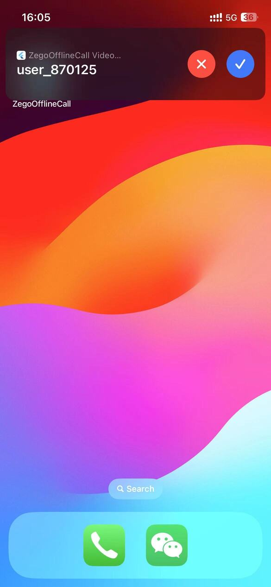

# zego_call

Online/Offline call implemented using ZEGO SDK


| Online Notification                                         | Offline Notification(iOS)                                             | Notification(Android)                                                         | In Call                                   |
| ----------------------------------------------------------- | --------------------------------------------------------------------- | ----------------------------------------------------------------------------- | ----------------------------------------- |
|  |  |  |  |
    
# How to run

## Config AppID & AppSign

- Go to [ZEGOCLOUD Admin Console](https://console.zegocloud.com/) to create a UIKit project.
- Get the `AppID` and `AppSign` of the project
- Config `yourSecretID` and `yourSecretAppSign` in **zego_call/lib/app/constants.dart**

## Config offline call

If you encounter configuration issues, please consult our technical support or refer to this [article](https://www.zegocloud.com/docs/uikit/callkit-flutter/quick-start-(with-call-invitation))

> When you get the resource id from the following steps, you should configure it to `offlineResourceID` in **zego_call/lib/call/constants.dart**

- android

  Please refer to the following steps to configure your Android project.

  - Firebase Console and ZEGO Console Configuration

    - In the Firebase console: Create a project. (Resource may help: [Firebase Console](https://console.firebase.google.com/))

      [](https://youtu.be/HhP7rLirCA4)
    - In the ZegoCloud console: Add FCM certificate, create a resource ID

      > In the create resource ID popup dialog, you should switch to the VoIP option for APNs, and switch to Data messages for FCM.
      >

      [](https://youtu.be/K3kRWyafRIY)

      When you have completed the configuration, you will obtain the resourceID. You can refer to the image below for comparison.
      
    - In the Firebase console: Create an Android application and modify your code

    [](https://youtu.be/0f9Ai2uJM5o)
  - Replace your google-service.json
- iOS

  Please refer to the following steps to configure your iOS project.

  - Apple Developer Center and ZEGOCLOUD Console Configuration
    - You need to refer to [Create VoIP services certificates](https://developer.apple.com/help/account/create-certificates/create-voip-services-certificates/) to create the   VoIP service certificate, and export a .p12 file on your Mac.
      [](https://youtu.be/UK9AUXcTGCE)
    - Add the voip service certificate .p12 file. Then, create a resource ID

      > In the create resource ID popup dialog, you should switch to the VoIP option for APNs, and switch to Data messages for FCM.
      >

      [](https://youtu.be/sYFeq7sZFEA)

      When you have completed the configuration, you will obtain the resourceID. You can refer to the image below for comparison.
      

# Code

## Structure:

```
├── main.dart
├── logger.dart
├── app: App APIs, account logic
│   ├── constants.dart
│   ├── login_service.dart
│   └── pages
│       ├── defines.dart
│       ├── home_page.dart
│       ├── login_page.dart
│       └── home
│           ├── contacts.dart
│           ├── dialpad.dart
│           ├── personal.dart
│           └── recents.dart
└── call: Call-related logic
    ├── constants.dart
    ├── prebuilt_call_route.dart: Jump to zego_uikit_prebuilt_call widget
    ├── protocol.dart: Call invitation protocol
    ├── components: Encapsulation of call components
    │   ├── calling_page.dart: Calling Widget (inviter)
    │   ├── online_invitation_notify.dart: Online invitation notification (invitee)
    │   └── buttons
    │       ├── send_call_button.dart: Call invitation button (for inviter)
    │       ├── cancel_call_button.dart: Cancel call button (for inviter)
    │       ├── accept_call_button.dart: Accept call button (for invitee)
    │       └── reject_call_button.dart: Reject call button (for invitee)
    └── service: Encapsulation of call service
        ├── data.dart
        ├── defines.dart
        ├── service.dart
        ├── android.utils.dart
        └── offline: Offline-related logic
        │   ├── data.dart
        │   ├── mixin.dart
        │   ├── android: Android offline-related logic
        │   │   └── events.dart: Android offline callback
        │   └── ios: iOS offline-related logic
        │       ├── ios.dart
        │       ├── data.dart
        │       └── events.dart: iOS offline callback
        └── online: Online-related logic
            ├── data.dart
            ├── events.dart
            ├── mixin.dart
            └── popups.dart
```

## Online Call

### Sequence Diagram:


## Offline Call

### Sequence Diagram:

### Receive & Cancel


### Accept


### Reject


### Click Empty Area Of Notification


### Different When the App is in the Background

- Android: app is still alive when in background, so will be received online call
  - Use `zego_callkit_incoming` to display a system notification and handle it like online call
- iOS:
  - it will quickly go offline.

### Implementation Details(Android)

> When an offline event handler be called, display the main function is `not woken up`, which means the app is `not activated`.
>
> Therefore, the following processing needs to be done:
>
> - offline event handler be called
>   - init push service: `ZegoPushService().init()`
>   - Listen for cancel events: `ZegoPushService().zimEvent.incomingInvitationCancelledEvent`
>     - Destroy the engine: `ZegoPushService().uninit()`
> - Accept the call
>   - Accept the call: `ZegoPushService().accept()`
>   - Cache the call information and the acceptance mark, and check if there is a corresponding cache when the app starts, if so, directly enter the call
>   - Destroy the engine: `ZegoPushService().uninit()`
> - Reject the call
>   - Reject the call: `ZegoPushService().refuse()`
>   - Destroy the engine: `ZegoPushService().uninit()`
> - Click the blank area to wake up
>   - Cache the call information, and check if there is a corresponding cache when the app starts, if so, treat it as an online call and pop up the online invitation
>   - Destroy the engine: `ZegoPushService().uninit()`

### Implementation Details(iOS)

> When an offline wake-up (offline notification appears), the `main` function is `woken up`, which means the app is `activated`.
>
> Therefore, only the following processing needs to be done:
>
> - Listen for the accept call event: `ZegoPushService().iOSCallKitEvent.callkitPerformAnswerCallActionEvent`
>   - Accept the call: `ZegoPushService().accept()`
> - Listen for the reject call event: `ZegoPushService().iOSCallKitEvent.callkitPerformEndCallActionEvent`
>   - Already in a call (triggered by clicking the hang up button on the large screen): `ZegoUIKitPrebuiltCallController().hangUp`
>   - Not in a call, reject the call: `ZegoPushService().refuse()`
