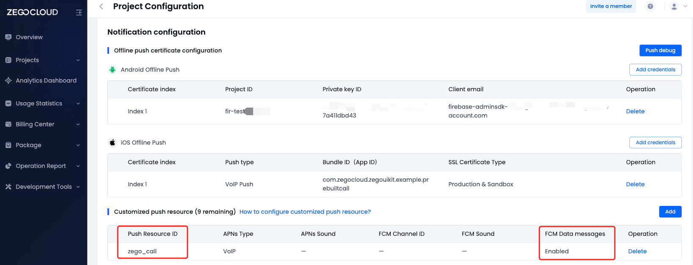

# zego_call_flutter

Online/Offline call implemented using ZEGO SDK


    
# How to run

## Config AppID & AppSign

- Go to [ZEGOCLOUD Admin Console](https://console.zegocloud.com/) to create a UIKit project.
- Get the `AppID` and `AppSign` of the project
- Config `yourSecretID` and `yourSecretAppSign` in **zego_call/lib/app/constants.dart**

## Config offline call

If you encounter configuration issues, please consult our technical support or refer to this [article](https://www.zegocloud.com/docs/uikit/callkit-flutter/quick-start-(with-call-invitation))

> When you get the resource id from the following steps, you should configure it to `offlineResourceID` in **zego_call/lib/call/constants.dart**

- android

  Please refer to the following steps to configure your Android project.

  - Firebase Console and ZEGO Console Configuration

    - In the Firebase console: Create a project. (Resource may help: [Firebase Console](https://console.firebase.google.com/))

      [](https://youtu.be/HhP7rLirCA4)
    - In the ZegoCloud console: Add FCM certificate, create a resource ID

      > In the create resource ID popup dialog, you should switch to the VoIP option for APNs, and switch to Data messages for FCM.
      >

      [](https://youtu.be/K3kRWyafRIY)

      When you have completed the configuration, you will obtain the resourceID. You can refer to the image below for comparison.
      
    - In the Firebase console: Create an Android application and modify your code

    [](https://youtu.be/0f9Ai2uJM5o)
  - Replace your google-service.json
- iOS

  Please refer to the following steps to configure your iOS project.

  - Apple Developer Center and ZEGOCLOUD Console Configuration
    - You need to refer to [Create VoIP services certificates](https://developer.apple.com/help/account/create-certificates/create-voip-services-certificates/) to create the   VoIP service certificate, and export a .p12 file on your Mac.
      [](https://youtu.be/UK9AUXcTGCE)
    - Add the voip service certificate .p12 file. Then, create a resource ID

      > In the create resource ID popup dialog, you should switch to the VoIP option for APNs, and switch to Data messages for FCM.
      >

      [](https://youtu.be/sYFeq7sZFEA)

      When you have completed the configuration, you will obtain the resourceID. You can refer to the image below for comparison.
      

# Code

## Structure:

```
├── main.dart
├── logger.dart
├── app: App APIs, account logic
│   ├── constants.dart
│   ├── login_service.dart
│   └── pages
│       ├── defines.dart
│       ├── home_page.dart
│       ├── login_page.dart
│       └── home
│           ├── group.dart
│           ├── home.dart
│           ├── lives.dart
│           └── personal.dart
└── live: Live-related logic
    ├── constants.dart
    ├── prebuilt_live_route.dart: Jump to zego_uikit_prebuilt_live_streaming widget
    ├── protocol.dart: Call invitation protocol
    └── service: Encapsulation of call service
        ├── data.dart
        ├── defines.dart
        ├── service.dart
        ├── android.utils.dart
        └── offline: Offline-related logic
            ├── data.dart
            ├── mixin.dart
            └── android: Android offline-related logic
                └── events.dart: Android offline callback
```

## Online Call

### Sequence Diagram:


### Implementation Details

#### APIs

- ZIMService().sendInvitation:

> send invitation
>
> - Function prototype:
>
> ```dart
>   Future<ZegoZIMSendInvitationResult> sendInvitation({
>     required List<String> invitees,
>     required int timeout,
>     String extendedData = '',
>     ZegoZIMPushConfig? pushConfig,
>   }) async 
>
>
> /// Description:Offline push configuration.
> class ZegoZIMPushConfig {
>   final String resourceID;
>
>   /// Description: Used to set the push title.
>   final String title;
>
>   /// Description: Used to set offline push content.
>   final String message;
>
>   /// Description: This parameter is used to set the pass-through field of offline push.
>   final String payload;
>
>   final ZegoZIMVoIPConfig? voipConfig;
> }
>
> /// send invitation result
> class ZegoZIMSendInvitationResult {
>   final PlatformException? error;
>   final String invitationID;
>   final String extendedData;
>   final Map<String, int /*reason*/ > errorInvitees;
> }
> ```
>
> - extendedData: external data, which will be attached to the invitation event received by the invitee. and you can set your custom request protocol here.
    >   >   - In the online invitation callback，value is in the ZegoZIMIncomingInvitationReceivedEvent.extendedData parameter of the incomingInvitationReceivedEvent event
    >   - In the offline invitation callback
          >     >     - android: in the ZPNsMessage.extras['payload'] of the onBackgroundMessageReceived(ZPNsMessage)
          >     - iOS: in the extras['payload'] of the onIncomingPushReceived(Map<dynamic, dynamic> extras, UUID uuid)
> - pushConfig: If this push needs to support offline push, this parameter should be configured. After configuration,
    >   >   - android: Receive offline callback in onBackgroundMessageReceived(ZPNsMessage)
    >   - iOS: Receive offline callback in onIncomingPushReceived(Map<dynamic, dynamic> extras, UUID uuid)

- ZIMService().cancelInvitation:

> cancel target invitation by `invitationID`
>
> - Function prototype:
>
> ```dart
> Future<ZegoZIMCancelInvitationResult> cancelInvitation({
>     required String invitationID,
>     required List<String> invitees,
>     String extendedData = '',
>     ZegoZIMIncomingInvitationCancelPushConfig? pushConfig,
>   }) async
>
> /// Description:Offline push configuration for cancel invitation
> class ZegoZIMIncomingInvitationCancelPushConfig {
>   /// Description: Used to set the push title.
>   String title;
>
>   /// Description: Used to set offline push content.
>   String content;
>
>   /// Description: This parameter is used to set the pass-through field of offline push.
>   String payload;
>
>   final String resourcesID;
> }
> ```
>
> - extendedData: external data, which will be attached to the invitation canceled event received by the invitee. and you can set your custom request protocol(with cancel reason) here.
    >   >   - In the online invitation callback，value is in the ZegoZIMIncomingInvitationCancelledEvent.extendedData parameter of the incomingInvitationCancelledEvent event
    >   - In the offline invitation callback
          >     >     - android: in the ZPNsMessage.extras['payload'] of the onBackgroundMessageReceived(ZPNsMessage)
          >     - iOS: in the extras['payload'] of the onIncomingPushReceived(Map<dynamic, dynamic> extras, UUID uuid)
> - pushConfig: If this push needs to support offline push, this parameter should be configured. After configuration,
    >   >   - android: Receive offline callback in onBackgroundMessageReceived(ZPNsMessage)
    >   - iOS: Receive offline callback in onIncomingPushReceived(Map<dynamic, dynamic> extras, UUID uuid)

- ZIMService().acceptInvitation:

> accept target invitation by `invitationID`
>
> - Function prototype:
>
> ```dart
>  Future<bool> acceptInvitation({
>    required String invitationID,
>    String extendedData = '',
>  }) async
> ```

- ZIMService().refuseInvitation:

> reject target invitation by `invitationID`
>
> - Function prototype:
>
> ```dart
>  Future<bool> refuseInvitation({
>    required String invitationID,
>    String extendedData = '',
>  }) async
> ```

- Events
  - ZIMService().event
    - incomingInvitationReceivedEvent: invitee receives a online call by the inviter.
    - incomingInvitationCancelledEvent: invitee receives the cancellation of the online call by the inviter.
    - incomingInvitationTimeoutEvent: invitee receives the timeout of the online call.
    - outgoingInvitationAcceptedEvent: inviter receives the acceptance of the invitation by the invitee.
    - outgoingInvitationRejectedEvent: inviter receives the rejection of the invitation by the invitee.
    - outgoingInvitationTimeoutEvent: inviter receives the timeout of the online call.

## Offline Call

### Sequence Diagram:


### Different When the App is in the Background

- Android: app is still alive when in background, so will be received online call
  - Use `zego_callkit_incoming` to display a system notification and handle it like online call
- iOS:
  - it will quickly go offline.

### Implementation Details(Android)

Use `zego_callkit_incoming` to display a system notification

> When an offline event handler be called, display  the main function is `not woken up`, which means the app is `not activated`.
>
> Therefore, the following processing needs to be done:
>
> - offline event handler be called
    >   - Start the ZIM engine, log in (remember, the following processing cannot log out, otherwise you will not receive offline anymore, because the account has logged out)
>   - Activate offline settings: `ZPNSService().enableOfflineNotify`
>   - Listen for cancel events: `ZIMService().event.incomingInvitationCancelledEvent`
      >     - Close the notification: `ZegoCallIncomingPlugin.instance.dismissAllNotifications`
>     - Destroy the engine: `ZIMService().uninit()`
> - Accept the call
    >   - Accept the call: `ZIMService().acceptInvitation`
>   - Cache the call information and the acceptance mark, and check if there is a corresponding cache when the app starts, if so, directly enter the call
>   - Activate the app, otherwise the app will not be woken up: `ZegoCallIncomingPlugin.instance.launchCurrentApp`
>   - Destroy the engine: `ZIMService().uninit()`
> - Reject the call
    >   - Reject the call: `ZIMService().refuseInvitation`
>   - Destroy the engine: `ZIMService().uninit()`
> - Click the blank area to wake up
    >   - Close the notification: `ZegoCallIncomingPlugin.instance.dismissAllNotifications`
>   - Cache the call information, and check if there is a corresponding cache when the app starts, if so, treat it as an online call and pop up the online invitation
>   - Destroy the engine: `ZIMService().uninit()`

### Implementation Details(iOS)

The built-in behavior of `zpns` will display a system notification

> When an offline wake-up (offline notification appears), the `main` function is `woken up`, which means the app is `activated`.
>
> Therefore, only the following processing needs to be done:
>
> - Listen for the accept call event: `CallKitEventHandler.performAnswerCallAction`
    >   - Accept the call: `ZIMService().acceptInvitation`
> - Listen for the reject call event: `CallKitEventHandler.performEndCallAction`
    >   - Already in a call (triggered by clicking the hang up button on the large screen): `ZegoUIKitPrebuiltCallController().hangUp`
>   - Not in a call, reject the call: `ZIMService().refuseInvitation`
