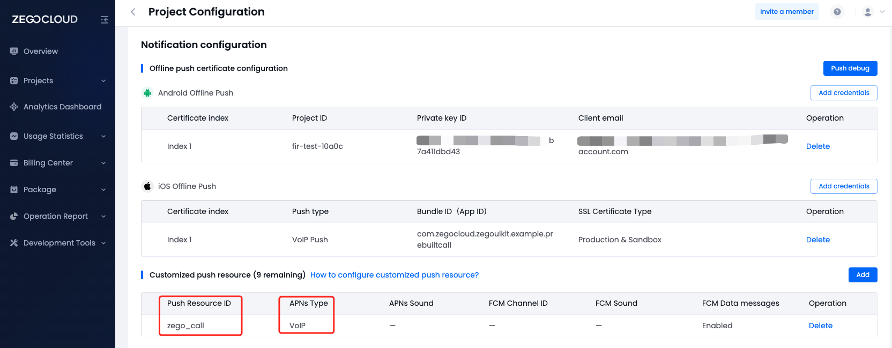

# zego_call_flutter

Online/Offline call implemented using ZEGO SDK


# How to run

## Config AppID & AppSign

 - Go to [ZEGOCLOUD Admin Console](https://console.zegocloud.com/) to create a UIKit project.
 - Get the `AppID` and `AppSign` of the project
 - Config `yourSecretID` and `yourSecretAppSign` in **zego_offline_call/lib/app/constants.dart**
 - Config `offlineResourceID` in **zego_offline_call/lib/call/constants.dart**, which get from next chapter

## Config offline call

If you encounter configuration issues, please consult our technical support or refer to this [article](https://www.zegocloud.com/docs/uikit/callkit-flutter/quick-start-(with-call-invitation))

- android
  
  Please refer to the following steps to configure your Android project. 
  - Firebase Console and ZEGO Console Configuration
    - In the Firebase console: Create a project. (Resource may help: [Firebase Console](https://console.firebase.google.com/))
      
      [](https://youtu.be/HhP7rLirCA4)
      
    - In the ZegoCloud console: Add FCM certificate, create a resource ID
      > In the create resource ID popup dialog, you should switch to the VoIP option for APNs, and switch to Data messages for FCM.
      
      [](https://youtu.be/K3kRWyafRIY)
      
      When you have completed the configuration, you will obtain the resourceID. You can refer to the image below for comparison.
      
      
    - In the Firebase console: Create an Android application and modify your code
      
     [](https://youtu.be/0f9Ai2uJM5o)

  - Replace your google-service.json 

- iOS
  
  Please refer to the following steps to configure your iOS project.

  - Apple Developer Center and ZEGOCLOUD Console Configuration
    - You need to refer to [Create VoIP services certificates](https://developer.apple.com/help/account/create-certificates/create-voip-services-certificates/) to create the   VoIP service certificate, and ​​​​​​​​​​​​​​​​​​​​​​​​​​​​​​​​​​​​​​​​export a .p12 file on your Mac.
      [](https://youtu.be/UK9AUXcTGCE)
    - Add the voip service certificate .p12 file. Then, create a resource ID
      > ​In the create resource ID popup dialog, you should switch to the VoIP option for APNs, and switch to Data messages for FCM.
      
      [](https://youtu.be/sYFeq7sZFEA)

      When you have completed the configuration, you will obtain the resourceID. You can refer to the image below for comparison.
      


# Code

## Structure:
```
├── main.dart
├── logger.dart
├── app: App interface, account logic
│   ├── constants.dart
│   ├── login_service.dart
│   └── pages
│       ├── defines.dart
│       ├── home_page.dart
│       ├── login_page.dart
│       └── home
│           ├── contacts.dart
│           ├── dialpad.dart
│           ├── personal.dart
│           └── recents.dart
├── call: Call-related logic
│   ├── constants.dart
│   ├── prebuilt_call_route.dart: Jump to zego_uikit_prebuilt_call interface
│   ├── protocol.dart: Call invitation protocol
│   ├── components: Encapsulation of call components
│   │   ├── calling_page.dart: Call interface (inviter)
│   │   ├── online_invitation_notify.dart: Online invitation notification (invitee)
│   │   └── buttons
│   │       ├── send_call_button.dart: Call invitation button (for inviter)
│   │       ├── cancel_call_button.dart: Cancel call button (for inviter)
│   │       ├── accept_call_button.dart: Accept call button (for invitee)
│   │       └── reject_call_button.dart: Reject call button (for invitee)
│   └── service: Encapsulation of call service
│       ├── data.dart
│       ├── defines.dart
│       ├── service.dart
│       ├── android.utils.dart
│       └── offline: Offline-related logic
│       │   ├── android.dart: Android offline-related logic
│       │   ├── data.dart
│       │   ├── mixin.dart
│       │   └── ios: iOS offline-related logic
│       │       ├── ios.dart
│       │       ├── data.dart
│       │       ├── defines.dart
│       │       └── events.dart: iOS offline callback
│       └── online: Online-related logic
│           ├── data.dart
│           ├── events.dart
│           ├── mixin.dart
│           └── popups.dart
└── core
    ├── defines.dart
    ├── protocol.dart
    ├── callkit: Zego_callkit interface encapsulation
    │   ├── data.dart
    │   ├── defines.dart
    │   ├── events.dart
    │   └── service.dart
    ├── zim: Zego_zim interface encapsulation
    │   ├── data.dart
    │   ├── defines.dart
    │   ├── events.dart
    │   └── service.dart
    └── zpns: Zego_zpns interface encapsulation
        ├── data.dart
        ├── defines.dart
        ├── events.dart
        └── service.dart
```


## Online Call Sequence Diagram:


## Offline Call Sequence Diagram:


